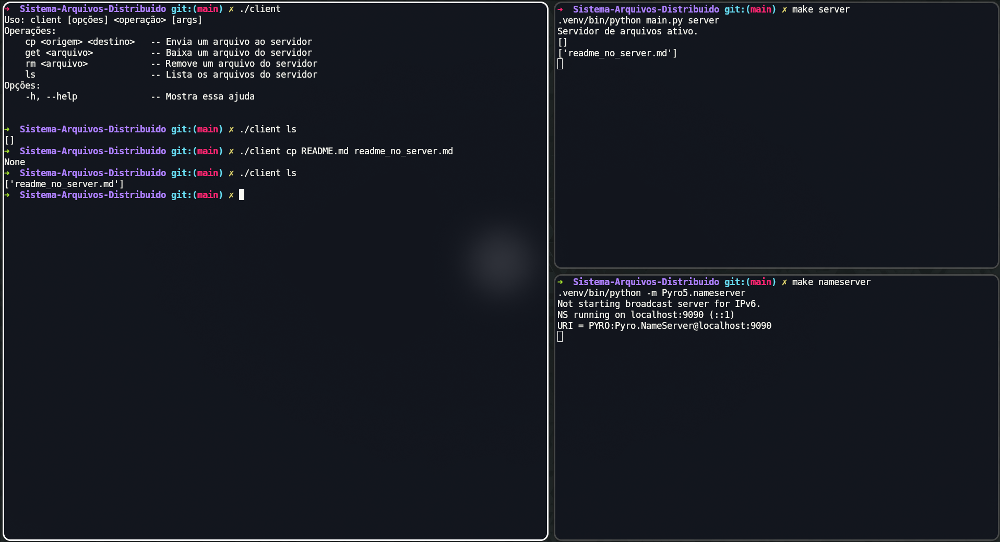
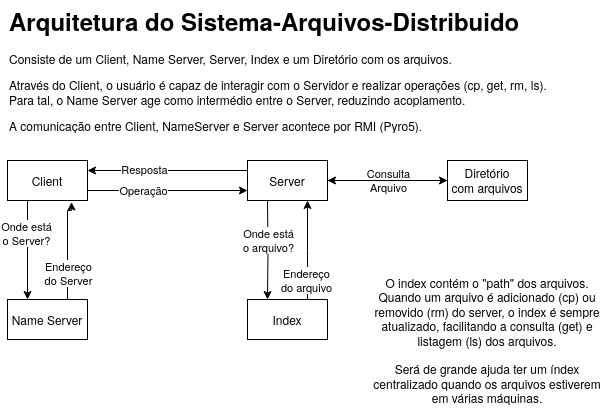

# Sistema-Arquivos-Distribuido

Um sistema de arquivos (centralizado por enquanto) que implementa as operações 
de Copy (cp), Remove (rm), Get (get), List (ls) feito com RMI (Pyro5).




## Executar

Dependências:
- Python
- Git
- Make

1. Clone o repositório localmente, crie uma venv python e instale as dependências
```
git clone https://github.com/Sevenings/Sistema-Arquivos-Distribuido.git
cd Sistema-Arquivos-Distribuido
make setup
```

2. No mesmo terminal execute o servidor de nomes
```
make nameserver
```

3. Em um segundo terminal, execute o servidor de arquivos
```
cd Sistema-Arquivos-Distribuido
make server
```

4. Em um terceiro terminal, execute o cliente
```
cd Sistema-Arquivos-Distribuido
./client [-h] <operação> [argumentos]
```

# Descrições técnicas

## Arquitetura

Componentes:
- Cliente
- Servidor de arquivos
- Servidor de nomes

O **client** é um programa pelo qual o usuário pode se comunicar com o servidor de arquivos.
Para tal, ele busca pelo **servidor de nomes** na rede local. Nele,
o **client** automaticamente obtém o endereço do servidor de
arquivos e envia ao **servidor** operação desejada (Copy, Get, List, Remove) e
seus respectivos parâmetros via RMI, o qual
processa sua requisição e retorna uma resposta (quando necessário).

O **server** suporta as operações de Copy (upload e download), Get
(download), List e Remove. Junto ao **server** há a implementação
de um **Index**, responsável por armazenar quais arquivos estão
armazenados e qual o seu path. Sempre que o Server faz uma operação
de Copy ou Remove, o index é atualizado. A operação de List foi
implementada em cima do Index e a de Get utiliza para saber qual o
path do arquivo, evitando consultas demoradas.

A biblioteca RMI utilizada é a Pyro5.

O **servidor de nomes** é o padrão da Pyro5.




## Limitações e Melhorias

1. **Servidor ocupado enquanto envia arquivos.** O suporte a múltiplos clientes 
não ocorre de maneira ideal, de forma que, durante operações de upload e 
download, o servidor não recebe requisições de outros clientes. (Single Thread)


